Linear Models
================
Clement Mugenzi
11/7/2019

# Linear Regression

``` r
data("nyc_airbnb")

nyc_airbnb = 
  nyc_airbnb %>% 
  mutate(stars = review_scores_location / 2) %>% 
  rename(
    boro = neighbourhood_group,
    neighborhood = neighbourhood) %>% 
  filter(boro != "Staten Island") %>% 
  select(price, stars, boro, neighborhood, room_type)
```

Fit the first linear model

``` r
fit = lm(price ~ stars + boro, data = nyc_airbnb)
```

``` r
fit
```

    ## 
    ## Call:
    ## lm(formula = price ~ stars + boro, data = nyc_airbnb)
    ## 
    ## Coefficients:
    ##   (Intercept)          stars   boroBrooklyn  boroManhattan     boroQueens  
    ##        -70.41          31.99          40.50          90.25          13.21

``` r
summary(fit)
```

    ## 
    ## Call:
    ## lm(formula = price ~ stars + boro, data = nyc_airbnb)
    ## 
    ## Residuals:
    ##    Min     1Q Median     3Q    Max 
    ## -169.8  -64.0  -29.0   20.2 9870.0 
    ## 
    ## Coefficients:
    ##               Estimate Std. Error t value Pr(>|t|)    
    ## (Intercept)    -70.414     14.021  -5.022 5.14e-07 ***
    ## stars           31.990      2.527  12.657  < 2e-16 ***
    ## boroBrooklyn    40.500      8.559   4.732 2.23e-06 ***
    ## boroManhattan   90.254      8.567  10.534  < 2e-16 ***
    ## boroQueens      13.206      9.065   1.457    0.145    
    ## ---
    ## Signif. codes:  0 '***' 0.001 '**' 0.01 '*' 0.05 '.' 0.1 ' ' 1
    ## 
    ## Residual standard error: 181.5 on 30525 degrees of freedom
    ##   (9962 observations deleted due to missingness)
    ## Multiple R-squared:  0.03423,    Adjusted R-squared:  0.03411 
    ## F-statistic: 270.5 on 4 and 30525 DF,  p-value: < 2.2e-16

``` r
coef(fit)
```

    ##   (Intercept)         stars  boroBrooklyn boroManhattan    boroQueens 
    ##     -70.41446      31.98989      40.50030      90.25393      13.20617

``` r
summary(fit)$coef
```

    ##                Estimate Std. Error   t value     Pr(>|t|)
    ## (Intercept)   -70.41446  14.020697 -5.022180 5.137589e-07
    ## stars          31.98989   2.527500 12.656733 1.269392e-36
    ## boroBrooklyn   40.50030   8.558724  4.732049 2.232595e-06
    ## boroManhattan  90.25393   8.567490 10.534465 6.638618e-26
    ## boroQueens     13.20617   9.064879  1.456850 1.451682e-01

tidythe results instead

``` r
fit %>% 
  broom::tidy() %>% 
  mutate(term = str_replace(term, "boro", "Boro: ")) %>% 
  knitr::kable(digits = 3)
```

| term            | estimate | std.error | statistic | p.value |
| :-------------- | -------: | --------: | --------: | ------: |
| (Intercept)     | \-70.414 |    14.021 |   \-5.022 |   0.000 |
| stars           |   31.990 |     2.527 |    12.657 |   0.000 |
| Boro: Brooklyn  |   40.500 |     8.559 |     4.732 |   0.000 |
| Boro: Manhattan |   90.254 |     8.567 |    10.534 |   0.000 |
| Boro: Queens    |   13.206 |     9.065 |     1.457 |   0.145 |

``` r
# another way to tidy is to use glance.
fit %>% 
  broom::glance()
```

    ## # A tibble: 1 x 11
    ##   r.squared adj.r.squared sigma statistic   p.value    df  logLik    AIC
    ##       <dbl>         <dbl> <dbl>     <dbl>     <dbl> <int>   <dbl>  <dbl>
    ## 1    0.0342        0.0341  182.      271. 6.73e-229     5 -2.02e5 4.04e5
    ## # … with 3 more variables: BIC <dbl>, deviance <dbl>, df.residual <int>

## Tak a look at factor…

``` r
nyc_airbnb = 
  nyc_airbnb %>% 
  mutate(
    boro = fct_infreq(boro),
    room_type = fct_infreq(room_type)
  )
```

refit the last model

``` r
fit = lm(price ~ stars + boro, data = nyc_airbnb)

fit %>% 
  broom::tidy()
```

    ## # A tibble: 5 x 5
    ##   term         estimate std.error statistic   p.value
    ##   <chr>           <dbl>     <dbl>     <dbl>     <dbl>
    ## 1 (Intercept)      19.8     12.2       1.63 1.04e-  1
    ## 2 stars            32.0      2.53     12.7  1.27e- 36
    ## 3 boroBrooklyn    -49.8      2.23    -22.3  6.32e-109
    ## 4 boroQueens      -77.0      3.73    -20.7  2.58e- 94
    ## 5 boroBronx       -90.3      8.57    -10.5  6.64e- 26

## diagnostics (all about the residuals)

boro against residuals

``` r
modelr::add_residuals(nyc_airbnb, fit) %>% 
  ggplot(aes(x = boro, y = resid)) +
  geom_violin() + ylim(-500, 500)
```

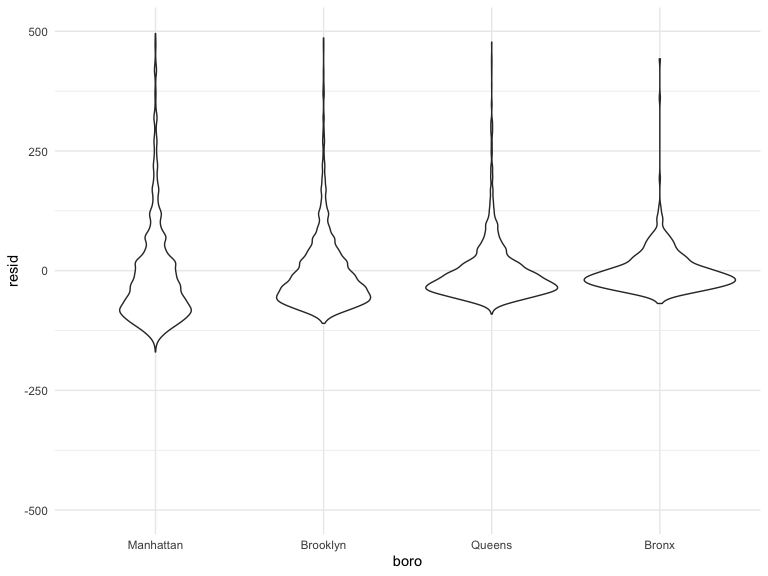

stars against residuals

``` r
modelr::add_residuals(nyc_airbnb, fit) %>% 
  ggplot(aes(x = stars, y = resid)) +
  geom_point() + ylim(-500, 500)
```

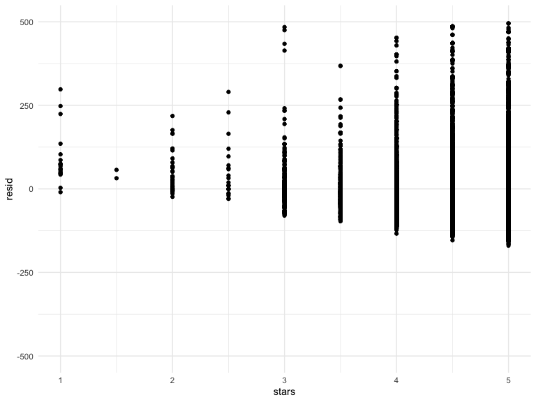

add some predictions

``` r
modelr::add_predictions(nyc_airbnb, fit)
```

    ## # A tibble: 40,492 x 6
    ##    price stars boro  neighborhood room_type        pred
    ##    <dbl> <dbl> <fct> <chr>        <fct>           <dbl>
    ##  1    99   5   Bronx City Island  Private room     89.5
    ##  2   200  NA   Bronx City Island  Private room     NA  
    ##  3   300  NA   Bronx City Island  Entire home/apt  NA  
    ##  4   125   5   Bronx City Island  Entire home/apt  89.5
    ##  5    69   5   Bronx City Island  Private room     89.5
    ##  6   125   5   Bronx City Island  Entire home/apt  89.5
    ##  7    85   5   Bronx City Island  Entire home/apt  89.5
    ##  8    39   4.5 Bronx Allerton     Private room     73.5
    ##  9    95   5   Bronx Allerton     Entire home/apt  89.5
    ## 10   125   4.5 Bronx Allerton     Entire home/apt  73.5
    ## # … with 40,482 more rows

# Nesting data

Here, every increase in stars and how it affects price per boro.

``` r
fit_interaction = 
  lm(price ~ stars * boro, data = nyc_airbnb) %>% 
  broom::tidy()

fit_interaction
```

    ## # A tibble: 8 x 5
    ##   term               estimate std.error statistic  p.value
    ##   <chr>                 <dbl>     <dbl>     <dbl>    <dbl>
    ## 1 (Intercept)           -34.3     19.8     -1.73  8.34e- 2
    ## 2 stars                  43.3      4.13    10.5   1.05e-25
    ## 3 boroBrooklyn           23.0     25.9      0.887 3.75e- 1
    ## 4 boroQueens             52.4     41.8      1.25  2.10e- 1
    ## 5 boroBronx              84.2     80.2      1.05  2.93e- 1
    ## 6 stars:boroBrooklyn    -15.3      5.46    -2.81  5.02e- 3
    ## 7 stars:boroQueens      -27.5      8.90    -3.09  2.00e- 3
    ## 8 stars:boroBronx       -38.4     17.9     -2.15  3.16e- 2

``` r
fit_interaction_1 = 
  nyc_airbnb %>% 
  lm(price ~ stars * boro + room_type * boro, data = .) %>% 
  broom::tidy() %>% 
  knitr::kable(digits = 3)
fit_interaction_1
```

| term                                |  estimate | std.error | statistic | p.value |
| :---------------------------------- | --------: | --------: | --------: | ------: |
| (Intercept)                         |    95.694 |    19.184 |     4.988 |   0.000 |
| stars                               |    27.110 |     3.965 |     6.838 |   0.000 |
| boroBrooklyn                        |  \-26.066 |    25.080 |   \-1.039 |   0.299 |
| boroQueens                          |   \-4.118 |    40.674 |   \-0.101 |   0.919 |
| boroBronx                           |   \-5.627 |    77.808 |   \-0.072 |   0.942 |
| room\_typePrivate room              | \-124.188 |     2.996 |  \-41.457 |   0.000 |
| room\_typeShared room               | \-153.635 |     8.692 |  \-17.676 |   0.000 |
| stars:boroBrooklyn                  |   \-6.139 |     5.237 |   \-1.172 |   0.241 |
| stars:boroQueens                    |  \-17.455 |     8.539 |   \-2.044 |   0.041 |
| stars:boroBronx                     |  \-22.664 |    17.099 |   \-1.325 |   0.185 |
| boroBrooklyn:room\_typePrivate room |    31.965 |     4.328 |     7.386 |   0.000 |
| boroQueens:room\_typePrivate room   |    54.933 |     7.459 |     7.365 |   0.000 |
| boroBronx:room\_typePrivate room    |    71.273 |    18.002 |     3.959 |   0.000 |
| boroBrooklyn:room\_typeShared room  |    47.797 |    13.895 |     3.440 |   0.001 |
| boroQueens:room\_typeShared room    |    58.662 |    17.897 |     3.278 |   0.001 |
| boroBronx:room\_typeShared room     |    83.089 |    42.451 |     1.957 |   0.050 |

Let’s try to map this instead

``` r
nyc_airbnb %>% 
  nest(data = -boro) %>% 
  mutate(
    models = map(.x = data, ~lm(price ~ stars + room_type, data = .x)),
    results = map(models, broom::tidy)
  ) %>% 
  select(boro, results) %>% 
  unnest(results)
```

    ## # A tibble: 16 x 6
    ##    boro      term                  estimate std.error statistic   p.value
    ##    <fct>     <chr>                    <dbl>     <dbl>     <dbl>     <dbl>
    ##  1 Bronx     (Intercept)              90.1      15.2       5.94 5.73e-  9
    ##  2 Bronx     stars                     4.45      3.35      1.33 1.85e-  1
    ##  3 Bronx     room_typePrivate room   -52.9       3.57    -14.8  6.21e- 41
    ##  4 Bronx     room_typeShared room    -70.5       8.36     -8.44 4.16e- 16
    ##  5 Queens    (Intercept)              91.6      25.8       3.54 4.00e-  4
    ##  6 Queens    stars                     9.65      5.45      1.77 7.65e-  2
    ##  7 Queens    room_typePrivate room   -69.3       4.92    -14.1  1.48e- 43
    ##  8 Queens    room_typeShared room    -95.0      11.3      -8.43 5.52e- 17
    ##  9 Brooklyn  (Intercept)              69.6      14.0       4.96 7.27e-  7
    ## 10 Brooklyn  stars                    21.0       2.98      7.05 1.90e- 12
    ## 11 Brooklyn  room_typePrivate room   -92.2       2.72    -34.0  6.40e-242
    ## 12 Brooklyn  room_typeShared room   -106.        9.43    -11.2  4.15e- 29
    ## 13 Manhattan (Intercept)              95.7      22.2       4.31 1.62e-  5
    ## 14 Manhattan stars                    27.1       4.59      5.91 3.45e-  9
    ## 15 Manhattan room_typePrivate room  -124.        3.46    -35.8  9.40e-270
    ## 16 Manhattan room_typeShared room   -154.       10.1     -15.3  2.47e- 52

``` r
manhattan_nest_lm_res = 
  nyc_airbnb %>% 
  filter(boro == "Manhattan") %>% 
  nest(data = -neighborhood) %>% 
  mutate(
    models = map(.x = data, ~lm(price ~ stars + room_type, data = .x)),
    results = map(models, broom::tidy)
  ) %>% 
  select(neighborhood, results) %>% 
  unnest(results)
```

Here we are plotting neighbrohoods in manhattan and what it would cost
if we moved from a private room to a shared room. it will cost less.

``` r
manhattan_nest_lm_res %>% 
  filter(str_detect(term, "room_type")) %>% 
  ggplot(aes(x = neighborhood, y = estimate)) + 
  geom_point() + 
  facet_wrap(~term) + 
  theme(axis.text.x = element_text(angle = 80, hjust = 1))
```


# Cross Validation

All about model selection. Picking variables to go in your model. know
confounders, covariates. What belongs in the model and what does not.
`AIC:` comparison between two nonnested models. how well does the model
fit, and how complex the model is. and whichever of those is better
wins. a less complex model. Checkout `BIC` too\!

Questions to ask ourselves:

1.  Overfitting or underfitting?

2.  which model works better for future dataset.

3.  Do i have high bias? high variance?

4.  how complex is the model?

5.  which model makes the best predictions for future datasets?

**Prediction accuracy:**

splitting your dataset and build the model using one dataset then
testing the model using the second dataset. Basically, splititing the
dataset into `train` and `test` datasets.

there is also **automated variable selection** using **Lasso** or
**regression trees**.

``` r
nonlin_df = 
  tibble(
    id = 1:100,
    x = runif(100, 0, 1),
    y = 1 - 10 * (x - .3) ^ 2 + rnorm(100, 0, .3)
  )

nonlin_df %>% 
  ggplot(aes(x = x, y = y)) + 
  geom_point() + theme_bw() 
```

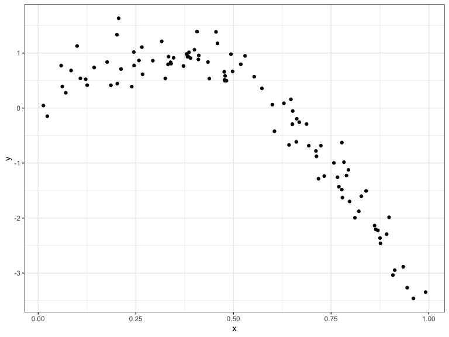

## Training and Testing

``` r
train_df = sample_n(nonlin_df, 80)
test_df = anti_join(nonlin_df, train_df, by = "id")

ggplot(train_df, aes(x = x, y = y)) + 
  geom_point() + 
  geom_point(data = test_df, color = "red")
```

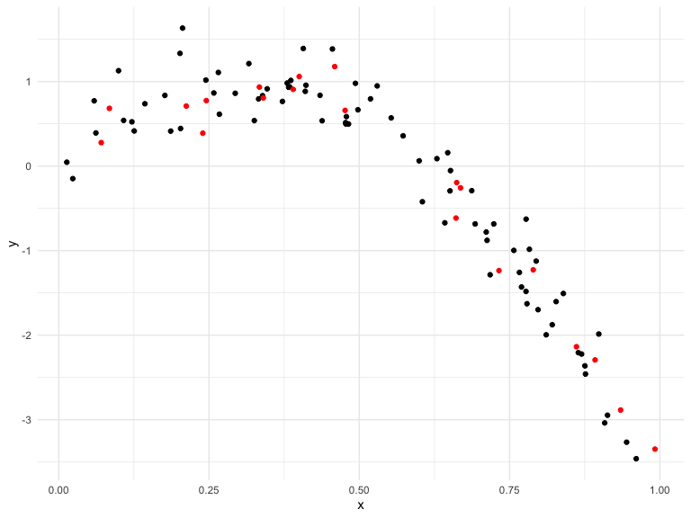

## fit three models of varying goodness

``` r
linear_mod = lm(y ~ x, data = train_df)
smooth_mod = mgcv::gam(y ~ s(x), data = train_df)
wiggly_mod = mgcv::gam(y ~ s(x, k = 30), sp = 10e-6, data = train_df)
```

lets’ look at some fits

``` r
train_df %>% 
  add_predictions(linear_mod) %>% 
  ggplot(aes(x = x, y = y)) + geom_point() + 
  geom_line(aes(y = pred), color = "red")
```

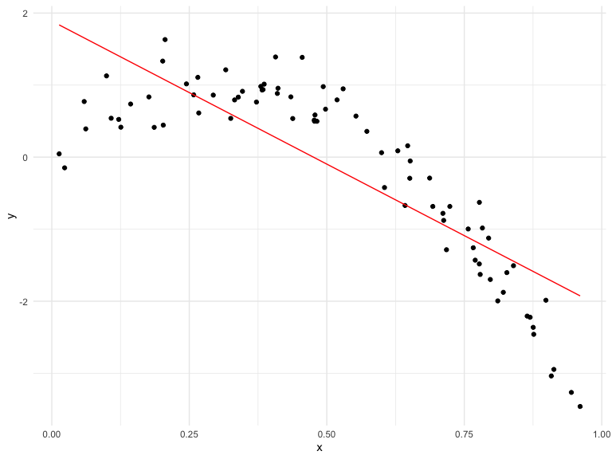

``` r
train_df %>% 
  add_predictions(smooth_mod) %>% 
  ggplot(aes(x = x, y = y)) + geom_point() + 
  geom_line(aes(y = pred), color = "red")
```

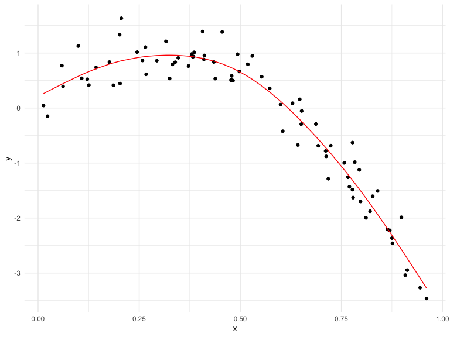

``` r
train_df %>% 
  add_predictions(wiggly_mod) %>% 
  ggplot(aes(x = x, y = y)) + geom_point() + 
  geom_line(aes(y = pred), color = "red")
```

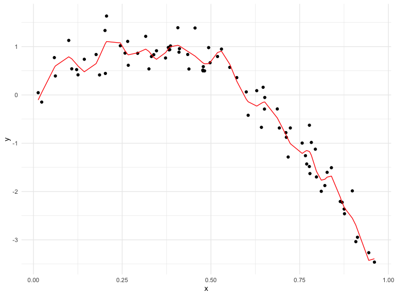

Make predictions

``` r
# Root mean squared error

rmse(linear_mod, train_df)
```

    ## [1] 0.7178747

``` r
rmse(smooth_mod, train_df)
```

    ## [1] 0.2874834

``` r
rmse(wiggly_mod, train_df)
```

    ## [1] 0.2498309

Here, the `wiggly_mod` is doing better but it does not matter.

``` r
# Root mean squared error

rmse(linear_mod, test_df)
```

    ## [1] 0.7052956

``` r
rmse(smooth_mod, test_df)
```

    ## [1] 0.2221774

``` r
rmse(wiggly_mod, test_df)
```

    ## [1] 0.289051

Therefore, the lesser the `RMSE` the better the model since errors are
minimized. Always choose the model that test better on the `Test`
dataset. Thus, here the `smooth_mod` is doing better.

## Cross Validation using `Modelr`

`cross_mc` splits the dataframe for us\!\!

``` r
cv_df = 
  crossv_mc(nonlin_df, 100)
cv_df
```

    ## # A tibble: 100 x 3
    ##    train      test       .id  
    ##    <list>     <list>     <chr>
    ##  1 <resample> <resample> 001  
    ##  2 <resample> <resample> 002  
    ##  3 <resample> <resample> 003  
    ##  4 <resample> <resample> 004  
    ##  5 <resample> <resample> 005  
    ##  6 <resample> <resample> 006  
    ##  7 <resample> <resample> 007  
    ##  8 <resample> <resample> 008  
    ##  9 <resample> <resample> 009  
    ## 10 <resample> <resample> 010  
    ## # … with 90 more rows

``` r
cv_df %>% pull(train) %>% .[[1]] %>% as_tibble
```

    ## # A tibble: 79 x 3
    ##       id      x       y
    ##    <int>  <dbl>   <dbl>
    ##  1     1 0.266   1.11  
    ##  2     2 0.372   0.764 
    ##  3     3 0.573   0.358 
    ##  4     4 0.908  -3.04  
    ##  5     6 0.898  -1.99  
    ##  6     7 0.945  -3.27  
    ##  7     8 0.661  -0.615 
    ##  8     9 0.629   0.0878
    ##  9    10 0.0618  0.392 
    ## 10    11 0.206   1.63  
    ## # … with 69 more rows

``` r
cv_df =
  cv_df %>% 
  mutate(
    train = map(train, as_tibble),
    test = map(test, as_tibble))
```

try fitting the linear model with all these… and comparing them by
`rmse`

``` r
cv_df = 
  cv_df %>% 
  mutate(linear_mod  = map(train, ~lm(y ~ x, data = .x)),
         smooth_mod  = map(train, ~mgcv::gam(y ~ s(x), data = .x)),
         wiggly_mod  = map(train, ~gam(y ~ s(x, k = 30), sp = 10e-6, data = .x))) %>% 
  mutate(rmse_linear = map2_dbl(linear_mod, test, ~rmse(model = .x, data = .y)),
         rmse_smooth = map2_dbl(smooth_mod, test, ~rmse(model = .x, data = .y)),
         rmse_wiggly = map2_dbl(wiggly_mod, test, ~rmse(model = .x, data = .y)))
```

let us visualize this

``` r
cv_df %>% 
  select(starts_with("rmse")) %>% 
  pivot_longer(
    everything(),
    names_to = "model", 
    values_to = "rmse",
    names_prefix = "rmse_") %>% 
  mutate(model = fct_inorder(model)) %>% 
  ggplot(aes(x = model, y = rmse)) + geom_violin()
```

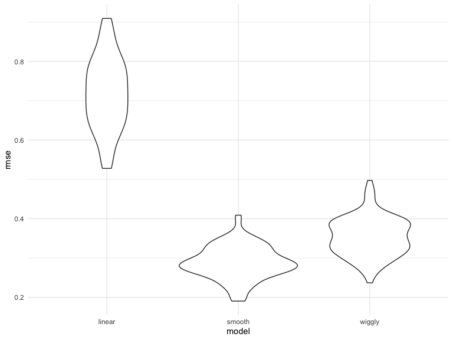

**Smooth model wins\!\!**

# Bootstrapping

simulated dataset

``` r
n_samp = 250

sim_df_const = 
  tibble(
    x = rnorm(n_samp, 1, 1),
    error = rnorm(n_samp, 0, 1),
    y = 2 + 3 * x + error
  )

sim_df_nonconst = sim_df_const %>% 
  mutate(
  error = error * .75 * x,
  y = 2 + 3 * x + error
)
```

here the second plot has a high variability as x-axis increases which
means the estimate of the slope is right but we cannot be confident of
the confidence interval.

``` r
sim_df = 
  bind_rows(const = sim_df_const, nonconst = sim_df_nonconst, .id = "data_source") 

sim_df %>% 
  ggplot(aes(x = x, y = y)) + 
  geom_point(alpha = .5) +
  stat_smooth(method = "lm") +
  facet_grid(~data_source) 
```

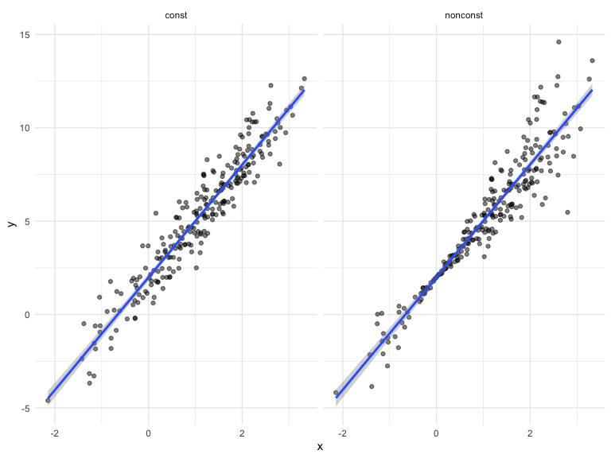

``` r
lm(y ~ x, data = sim_df_const) %>% 
  broom::tidy() %>% 
  knitr::kable(digits = 3)
```

| term        | estimate | std.error | statistic | p.value |
| :---------- | -------: | --------: | --------: | ------: |
| (Intercept) |    1.988 |      0.09 |    22.005 |       0 |
| x           |    3.016 |      0.06 |    50.386 |       0 |

``` r
lm(y ~ x, data = sim_df_nonconst) %>% 
  broom::tidy() %>% 
  knitr::kable(digits = 3)
```

| term        | estimate | std.error | statistic | p.value |
| :---------- | -------: | --------: | --------: | ------: |
| (Intercept) |    2.002 |     0.101 |    19.818 |       0 |
| x           |    3.015 |     0.067 |    45.044 |       0 |

## How can i bootstrap

write a function to draw a bootstrap sample based on the dataframe.

Here, subjects are not put back in the original population.

``` r
sim_df_nonconst %>% 
  sample_frac(size = 1) %>% 
  arrange(x)
```

    ## # A tibble: 250 x 3
    ##        x   error       y
    ##    <dbl>   <dbl>   <dbl>
    ##  1 -2.15  0.263  -4.18  
    ##  2 -1.42  0.111  -2.15  
    ##  3 -1.38 -1.71   -3.86  
    ##  4 -1.26  1.30   -0.493 
    ##  5 -1.26  1.79    0.0186
    ##  6 -1.17  1.56    0.0643
    ##  7 -1.16  0.0502 -1.42  
    ##  8 -1.14 -0.688  -2.10  
    ##  9 -1.13  0.377  -1.02  
    ## 10 -1.05 -1.62   -2.75  
    ## # … with 240 more rows

here we sampling but subjects are put back in the population. yield
different results.

``` r
sim_df_nonconst %>% 
  sample_frac(size = 1, replace = T) %>% 
  arrange(x)
```

    ## # A tibble: 250 x 3
    ##        x   error       y
    ##    <dbl>   <dbl>   <dbl>
    ##  1 -2.15  0.263  -4.18  
    ##  2 -2.15  0.263  -4.18  
    ##  3 -1.26  1.30   -0.493 
    ##  4 -1.26  1.79    0.0186
    ##  5 -1.16  0.0502 -1.42  
    ##  6 -1.16  0.0502 -1.42  
    ##  7 -1.16  0.0502 -1.42  
    ##  8 -1.14 -0.688  -2.10  
    ##  9 -1.13  0.377  -1.02  
    ## 10 -1.05 -1.62   -2.75  
    ## # … with 240 more rows

``` r
boot_sample = function(df) {
  sample_frac(df, replace = TRUE)
}
```

Since there is replacement, the plots are different everytime we run the
code.

``` r
boot_sample(sim_df_nonconst) %>% 
  ggplot(aes(x = x, y = y)) + 
  geom_point(alpha = .5) +
  stat_smooth(method = "lm")
```

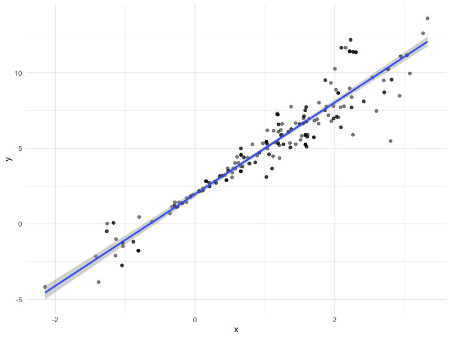

organize a dataframe… basically keeping track of the results we care
about.

``` r
boot_straps = 
  tibble(
    strap_number = 1:1000,
    strap_sample = rerun(1000, boot_sample(sim_df_nonconst))
  )
```

do some kind of analysis. Again, here it is with replacement, so that is
why we are getting different results everytime the code is ran.

``` r
bootstraps_results = 
  boot_straps %>% 
  mutate(
    models = map(strap_sample, ~lm(y ~ x, data = .x)),
    results = map(models, broom::tidy)
  ) %>% 
  select(-strap_sample, -models) %>% 
  unnest(results)
```

summarize these results. calculating the standard deviation of the
estimates. equivalent to the error term in the simple linear regression.
basing inference on default procedures…. **read about bootstrapping on
your own time**

``` r
bootstraps_results %>% 
  group_by(term) %>% 
  summarise(se = sd(estimate))
```

    ## # A tibble: 2 x 2
    ##   term            se
    ##   <chr>        <dbl>
    ## 1 (Intercept) 0.0648
    ## 2 x           0.0758

## try the `modelr` package

``` r
sim_df_nonconst %>% 
  bootstrap(n = 1000) %>% 
  mutate(
    models = map(strap, ~lm(y ~ x, data = .x) ),
    results = map(models, broom::tidy)) %>% 
  select(-strap, -models) %>% 
  unnest(results) %>% 
  group_by(term) %>% 
  summarize(boot_se = sd(estimate))
```

    ## # A tibble: 2 x 2
    ##   term        boot_se
    ##   <chr>         <dbl>
    ## 1 (Intercept)  0.0667
    ## 2 x            0.0791

## what if your assumptions are not wrong?

with a different data input.

``` r
sim_df_const %>% 
  modelr::bootstrap(n = 1000) %>% 
  mutate(models = map(strap, ~lm(y ~ x, data = .x) ),
         results = map(models, broom::tidy)) %>% 
  select(-strap, -models) %>% 
  unnest(results) %>% 
  group_by(term) %>% 
  summarize(boot_se = sd(estimate))
```

    ## # A tibble: 2 x 2
    ##   term        boot_se
    ##   <chr>         <dbl>
    ## 1 (Intercept)  0.0934
    ## 2 x            0.0611

## the airbnb data

``` r
data("nyc_airbnb")

nyc_airbnb = 
  nyc_airbnb %>% 
  mutate(stars = review_scores_location / 2) %>% 
  rename(
    boro = neighbourhood_group,
    neighborhood = neighbourhood) %>% 
  filter(boro != "Staten Island") %>% 
  select(price, stars, boro, neighborhood, room_type)
```

``` r
nyc_airbnb %>% 
  ggplot(aes(x = stars, y = price, color = room_type)) + 
  geom_point() 
```

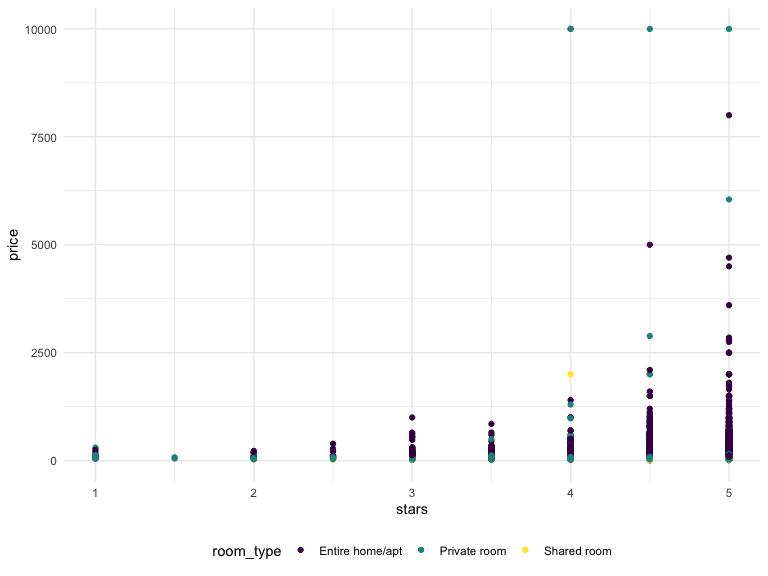

``` r
nyc_airbnb %>% 
  filter(boro == "Manhattan") %>% 
  modelr::bootstrap(n = 1000) %>% 
  mutate(
    models = map(strap, ~ lm(price ~ stars + room_type, data = .x)),
    results = map(models, broom::tidy)) %>% 
  select(results) %>% 
  unnest(results) %>% 
  filter(term == "stars") %>% 
  ggplot(aes(x = estimate)) + geom_density()
```

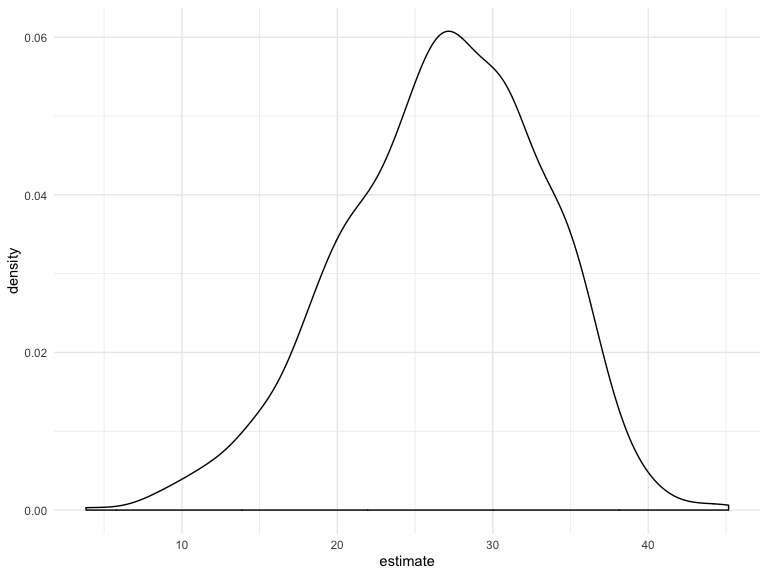
